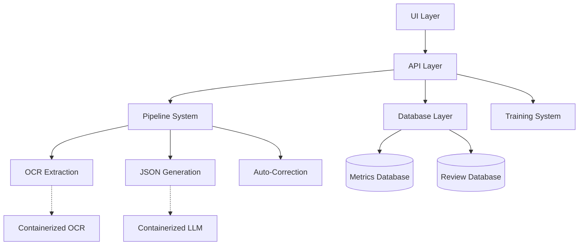

# SkillLab Architecture Overview

This document provides a detailed overview of the SkillLab system architecture, describing its components, interactions, and design patterns.

## Architectural Principles

SkillLab follows these core architectural principles:

1. **Separation of Concerns**: Clean boundaries between system components
2. **Repository Pattern**: Consistent data access through repositories
3. **API-First Design**: All functionality available through clean APIs
4. **Dependency Injection**: Components receive dependencies through constructors
5. **Factory Pattern**: Creation of UI components through factory methods
6. **Adapter Pattern**: Interface adaptation between layers
7. **Pipeline Pattern**: Sequential processing of data through discrete steps

## System Architecture

The system is organized into several distinct layers:

### 1. UI Layer

The UI layer provides user interfaces in both CLI and web formats:

- **Base Components**: Abstract interfaces defined in `ui/base.py`
- **CLI Components**: Terminal-based interface in `ui/cli/`
- **Web Components**: Streamlit-based interface in `ui/web/`
- **Component Factory**: `ui/common/factory.py` implements the factory pattern for UI creation
- **UI Adapters**: `ui/common/adapter.py` connects UI components to the API layer

The UI layer is designed to be modular, allowing different interface implementations while maintaining consistent functionality.

### 2. API Layer

The API layer serves as the primary interface to system functionality:

- **Extraction API**: `api/extraction.py` - Resume extraction operations
- **Training API**: `api/training.py` - Model training operations
- **Review API**: `api/review.py` - Document review operations
- **Monitoring API**: `api/monitoring.py` - System monitoring operations
- **Health API**: `api/health.py` - Service health checks

Each API module provides consistent error handling, input validation, and return types. The API layer is the only way to interact with the system's functionality, ensuring a clean separation between UI and implementation.

### 3. Database Layer

The database layer implements the repository pattern for data access:

- **Base Repository**: `database/core.py` - Core repository functionality
- **Metrics Repository**: `database/metrics_db.py` - Metrics storage and retrieval
- **Review Repository**: `database/review_db.py` - Document review state management
- **Synchronization**: `database/sync.py` - Keeps databases in sync

All database access goes through repository classes, which provide a consistent interface and proper error handling. This approach isolates database operations and makes testing easier.

### 4. Pipeline System

The pipeline system implements a step-based approach to document processing:

- **Pipeline Base**: `pipeline/base.py` - Interfaces and base classes
- **Pipeline Executor**: `pipeline/executor.py` - Orchestrates step execution
- **Pipeline Steps**: `pipeline/steps/` - Individual processing steps

The pipeline uses the pipeline pattern to process documents sequentially through defined steps. Each step has a clear input/output contract and handles its specific transformation.

### 5. Extraction System

The extraction system handles OCR and JSON generation:

- **OCR Extraction**: `extraction/ocr_extractor.py` - PDF to text conversion
- **JSON Generation**: `extraction/json_generator.py` - Text to structured JSON
- **Auto-Correction**: `extraction/auto_correction.py` - Validation and correction

Extraction can use either local libraries or containerized services, based on configuration.

### 6. Docker Services

The system uses containerized services for OCR and LLM inference:

- **PaddleOCR Service**: `docker/paddleocr/` - OCR processing service
- **Ollama Service**: `docker/ollama/` - LLM inference for JSON generation

These services are managed through Docker Compose and provide HTTP APIs for the extraction system.

### 7. Training System

The training system manages Donut model training:

- **Dataset Builder**: `training/dataset_builder.py` - Creates training datasets
- **Model Trainer**: `training/train_donut.py` - Fine-tunes Donut model

### 8. Monitoring & Review

The monitoring and review systems provide insights and human feedback:

- **Metrics Collection**: `monitor/metrics.py` - Gathers performance metrics
- **Dashboard**: `monitor/dashboard.py` - Displays system status
- **Review Interface**: `review/app.py` - Web interface for document review

## Data Flow

The typical data flow through the system is:

1. User initiates processing through CLI or web UI
2. API layer receives request and validates inputs
3. Pipeline executor orchestrates the processing steps:
   a. PDF documents are sent to OCR extraction
   b. Extracted text is sent to JSON generation
   c. Generated JSON is validated and corrected
4. Documents requiring human review are flagged
5. Review system displays flagged documents for human verification
6. Validated documents are used to build training datasets
7. Training system fine-tunes Donut model on the datasets
8. Metrics are collected throughout the process

## Configuration System

The configuration system manages application settings:

- **Default Config**: `config/default.yaml` - Base configuration values
- **Config Loader**: `config/loader.py` - Loads and merges configurations
- **Schema Validation**: `config/schema.py` - Validates configuration

Configuration can be overridden through environment variables, command-line arguments, or user-provided config files.

## Design Patterns

SkillLab uses several design patterns:

1. **Repository Pattern**
   - Used for database access
   - Centralizes data access logic
   - Makes testing easier with mocks

2. **Factory Pattern**
   - Creates UI components
   - Abstracts component creation
   - Allows runtime UI type selection

3. **Adapter Pattern**
   - Connects UI components to APIs
   - Converts between data formats
   - Isolates UI from implementation

4. **Pipeline Pattern**
   - Processes documents through steps
   - Each step has clear inputs/outputs
   - Allows flexible pipeline configuration

5. **Singleton Pattern**
   - Used for configuration and logging
   - Ensures single instance with global access

6. **Observer Pattern**
   - Used for metrics collection
   - Monitors system events
   - Updates metrics without tight coupling

## Extensibility

The system is designed for extensibility:

- **New Pipeline Steps**: Add new classes implementing the Step interface
- **New UI Components**: Create new classes implementing component interfaces
- **New Repositories**: Extend BaseRepository for new data types
- **New APIs**: Add new modules following the established pattern

## Conclusion

SkillLab's architecture provides a solid foundation for resume data extraction and model training. The clear separation of concerns, consistent use of design patterns, and modular structure make the system maintainable, testable, and extensible. The containerized services ensure reliable processing, while the API-first approach enables multiple interface options.